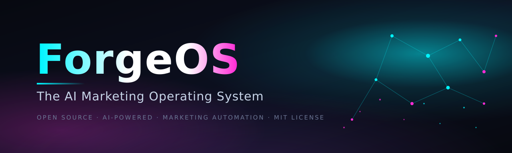

<p align="center">
  <a href="LICENSE"></a>
  
  
  
  
</p>

# Set Up Your Own Marketing OS with the FORGE Framework

Most businesses market by hand: a post here, an email there, whatever there was
time for this week. A marketing OS flips that — one system that **generates**
on-brand content with AI, **sends** it across every channel on schedule, and
**learns** from what worked. Built once, it runs every week.

Five layers, built in this order, one ready-made prompt per layer, plus a
prompt that interviews you first. Paste a card into Claude Code and it walks
you through building that piece, one step at a time — against the working
scaffold in this repo, or from scratch if you prefer.

## FORGE

| Letter | Layer | One line |
| --- | --- | --- |
| **F** | Foundation | one brand kit for the whole business, so every word the AI writes sounds like you |
| **O** | Origination | an AI generation pipeline: draft, guardrail-check, human approve — nothing ships unreviewed |
| **R** | Reach | every channel behind one interface; stubs first, so the whole loop runs with zero keys |
| **G** | Growth | campaigns: sequences, schedules, triggers, and a weekly autopilot plan |
| **E** | Evidence | analytics that feed the next week's generation — the loop closes |

Build them in exactly that order. Evidence is the last thing you need, not the
first — a dashboard over an empty pipeline measures nothing. The brand kit and
the generation pipeline are where the value lives.

## Three questions before you build anything

1. Could an AI write a post for your business tomorrow that your best customer
   would believe you wrote?
2. If you stopped touching marketing for a month, would anything still go out?
3. When something works, do you know why — or do you just feel good about it?

If the answer to all three is "no", build the layers below in order.

## Where are you now? The five ladders

| Layer | Level 1 | Level 2 | Level 3 |
| --- | --- | --- | --- |
| Foundation | marketing "voice" lives in the owner's head | a doc describing the brand that nobody opens | a brand kit file every prompt is rendered through |
| Origination | AI writes, you post whatever comes out | you edit drafts before posting | draft → guardrail → approval queue; nothing ships unreviewed |
| Reach | one channel, posted by hand | two channels, copy-pasted between them | one interface, every channel; stubs let you test with zero keys |
| Growth | random acts of marketing | a content calendar you sometimes follow | sequences, triggers, and a weekly plan the system drafts for you |
| Evidence | vibes | you check likes sometimes | opens/clicks/conversions feed next week's brief automatically |

Each card below takes one layer to level 3.

## Card 0: Let Claude interview you first

Don't write the brand kit yourself. Twenty minutes of questions, one at a
time, beats an afternoon of you trying to describe your own voice. Run it as
many times as you like — once per product line, once per audience. Every
session leaves a file behind.

```
Before you write anything, interview me. Ask one question at a time and
wait for my answer. Cover, in this order: what my business sells and to
whom, the offer I'm proudest of, the five marketing tasks I actually do
each week, where my customers hang out, three brands whose marketing I
admire and why, words or phrases I never want used, and the one campaign
that flopped and what I think went wrong. Push back when an answer is
vague. Save every question and answer as we go to
interviews/<today>-<topic>.md. When I say "stop", draft the first
version of my brand kit from the answers (the shape in Card 1), and list
what you still don't know.
```

## Card 1: Foundation

Every AI-written word your business publishes should pass through one file:
who you are, who you serve, how you sound, what you never say, and what
you're selling this quarter. Without it, the AI writes generic marketing
that could belong to anyone. With it, a draft needs editing, not rewriting.

Two rules keep it honest:

- **The brand kit is the only source of truth for voice.** No prompt, template,
  or campaign may carry its own tone settings — they all render through the kit.
- **One kit per business, versioned.** When the voice changes, you change one
  file, and everything generated after that follows.

```
Build the Foundation layer of my marketing OS:

- one brand kit file (brand-kit.md) with these fixed sections in this
  order: Business, Audience, Voice, Never Say, Offers, Proof. Keep it
  under 80 lines. Every line is "- **Field**: value".
- a system-prompt builder that takes the brand kit plus a content brief
  (kind, topic, length, channel) and returns the full prompt for the LLM.
  No prompt anywhere else in the system may set tone or voice.
- a validator that rejects any generation request missing a brand kit
  version, and logs which version was used for every draft.

Then prove it: generate the same brief twice, once with the kit and once
with the kit's Voice section blanked out, and show me the difference.
```

*In this repo: `packages/forge-llm/forge_llm/brand.py`, brand kit onboarding in
the web UI (`/onboarding`), `apps/api/app/routers/brand_kits.py`.*

## Card 2: Origination

The generation pipeline has three stages and one iron rule: **nothing reaches
a customer that a human hasn't approved.** The AI drafts, automated guardrails
check (banned words, claims without proof, off-voice phrasing), and the draft
parks in an approval queue. You approve or reject in one click. Autopilot —
auto-approving trusted content types — is something you earn after the queue
has proven itself, never the starting point.

```
Build the Origination layer:

- a generation job that takes (brand kit version, brief) and returns a
  draft asset: rendered prompt -> LLM call -> guardrail checks ->
  stored as version 1 with status "in_review". Log tokens and cost
  per generation.
- guardrails as a separate, testable module: banned-word list from the
  brand kit's Never Say section, a max-claims check (any sentence with
  "best", "guaranteed", "#1" must cite a Proof entry), and a voice
  check that flags drafts drifting from the kit.
- an approval queue: list in_review assets, approve/reject with one
  action, every decision recorded with who and when. Only "approved"
  assets may be attached to a campaign step — enforce this in code,
  not convention.
- a provider abstraction with at least two providers (one real, one
  deterministic stub) so the whole pipeline runs with zero API keys.

Show me: generate 3 drafts, reject one in the queue, and prove the
rejected one cannot be attached to a campaign.
```

*In this repo: `packages/forge-llm/` (providers, prompts, guardrails,
costing), asset library + approvals inbox in the web UI (`/assets`,
`/approvals`), `apps/api/app/routers/assets.py`.*

## Card 3: Reach

One interface for every channel — email, SMS, social — with two modes: **stub**
and **live**. Stub mode is the default and the discipline: the entire
generate → approve → send → measure loop must work on a laptop with zero
external keys, writing every "sent" message to a dev outbox you can inspect.
You flip a channel to live only by adding its credentials, and the code path
doesn't change. If a channel can't run on stubs, it isn't done.

```
Build the Reach layer:

- a channel interface with exactly these operations: send(recipient,
  content, metadata) -> receipt, plus a status check. Implement it for
  email, SMS, and one social channel.
- every channel ships with a stub implementation that records the
  message to a dev outbox (queryable API + simple UI page) instead of
  sending. CHANNEL_MODE=stub is the default; nothing may attempt the
  network in stub mode.
- live implementations read credentials only from the environment,
  never from code or the database. Document every required variable in
  one place.
- a send log: every attempt (stub or live) records channel, recipient,
  asset version, campaign step, timestamp, and provider receipt or
  error. Retries with backoff on transient failures, max 3 attempts.

Show me: run the same campaign step against stub email, stub SMS, and
stub social, then show me all three in the outbox with their log rows.
```

*In this repo: `packages/forge-channels/` (email, SMS, social, stubs,
outbox), dev outbox in the web UI (`/outbox`), `apps/api/app/routers/outbox.py`.*

## Card 4: Growth

Campaigns turn one-off sends into a system: multi-step sequences (welcome
series, launch week, re-engagement), schedules (every Tuesday 9am), and
triggers (new contact → welcome series starts). On top sits the weekly
autopilot: the system drafts next week's content plan from the brand kit,
the calendar, and last week's evidence — you approve the plan on Monday,
and the week runs itself.

```
Build the Growth layer:

- a campaign model: ordered steps, each step = (approved asset,
  channel, delay or schedule, audience segment). A campaign has
  draft -> scheduled -> running -> finished states.
- a scheduler worker that wakes every minute, finds due steps, and
  enqueues sends through the Reach layer. Event triggers (e.g. a new
  contact) start the right sequence immediately.
- audience segments with consent tracking: no contact receives
  anything without an opt-in record, and every message carries the
  segment it went to.
- the weekly autopilot: a job that drafts next week's plan (which
  assets, which channels, which days) from the brand kit + last
  week's evidence summary, parks it for Monday approval, and only
  schedules what was approved.

Show me: a 3-step welcome sequence triggered by a new contact, run it
end to end on stubs, and show me the autopilot drafting next week's
plan from the evidence it collected.
```

*In this repo: `apps/worker/worker/jobs.py` (`campaign_tick`, triggers, `autopilot_plan` — drafts each business's content plan on its own configured schedule: `plan_day`/`plan_hour`/`plan_cadence`, default Monday 06:00 business-local weekly), `apps/api/app/routers/campaigns.py` + `apps/api/app/routers/autopilot.py` (`GET /autopilot/plan`, `POST /autopilot/plan/approve` → materializes a running campaign, `POST /autopilot/plan/run-now` → manual draft), content calendar + plan review in the web UI (`/calendar`, `/campaigns`, `/autopilot`).*

## Card 5: Evidence

Analytics with one job: make next week's marketing better than this week's.
Track opens, clicks, and conversions per asset, per step, per campaign —
then summarize weekly into the brief the Origination layer reads. A
dashboard that only shows numbers is decoration; evidence that doesn't feed
generation is trivia. Build this last. It's the part people screenshot, not
the part that earns its keep.

```
Build the Evidence layer:

- an event ingestion endpoint: opened, clicked, converted, bounced —
  each tied to the exact send (and therefore asset version, step,
  campaign) that caused it.
- a per-campaign overview: sends, opens, clicks, conversions, and
  rates, computed from the send log, never from a cache that can
  drift.
- a weekly summary job: top 3 and bottom 3 assets by conversion rate,
  best channel per segment, one paragraph of "what to do more of" —
  written into a file the Origination brief template reads.
- the dashboard rule: every panel shows its own data timestamp and
  marks stale panels instead of hiding them. No panel may write to
  the store it reads from.

Show me: fake a week's engagement on stubs, then show me the weekly
summary changing the next generation brief.
```

*In this repo: `apps/api/app/routers/analytics.py` (incl. `GET /analytics/weekly-summary`), `events.py`, webhook ingestion, analytics views in the web UI (`/analytics`), and the hourly `weekly_summary` worker job in `apps/worker/worker/jobs.py` (top/bottom assets, best channel per segment, recommendation paragraph wired into the Origination brief).*

## Six rules carried into every layer

1. **The brand kit is the only voice.** Nothing sets tone except the kit.
2. **Nothing ships unapproved** — until autopilot is earned, per content type.
3. **Stubs first.** The full loop runs with zero keys or the layer isn't done.
4. **Every send is logged**, every log is readable, every number is recomputable.
5. **One fact, one home.** A contact, an asset, a decision — written once,
   referenced everywhere.
6. **Smallest working loop first.** Generate → approve → send → measure for
   one channel before adding the second.

## What I am deliberately not building

- A CRM. Your contacts live wherever they live; ForgeOS reads segments, it
  doesn't replace your customer records.
- A design tool. It writes words; brand visuals stay in your design system.
- Multi-business agencies (yet). One tenant is one business, done properly,
  before any agency layer.
- Auto-posting without approval as the default. Growth theater that spams your
  audience is the opposite of this project.

## What it costs

- **$0** to build and run the whole loop on stubs — Docker, Postgres, Redis,
  and the stub LLM/channel providers. A laptop is enough.
- **LLM usage** when you go live: pay-per-token to your provider (Claude API
  or equivalent), logged per generation so you always know the number.
- **Infra** when you deploy: one small VPS runs the compose stack; the
  `infra/k8s/` manifests are there when you outgrow it.

## The implementation

This repo is the working reference implementation of the framework above —
every card maps to real modules (noted under each card). The fastest way to
feel the loop:

```bash
# 1. Start everything (postgres, redis, api, worker, web)
docker compose up --build

# 2. Load the demo tenant (idempotent — safe to re-run)
make seed
#    business "Acme Demo Co", brand kit, 12 contacts, 3 templates,
#    3 approved assets, 1 running campaign, 5 seeded sends.

# 3. Open the app: http://localhost:8080
```

Demo login: `demo@forgeos.local` / `demo1234` (Acme Demo Co) · second login: `demo2@forgeos.local` / `demo1234` (Beta Demo Co)

Walk the loop on stubs (nothing leaves your machine): **generate** an asset
(`/assets` or `POST /api/v1/assets/generate`) → **approve** it (`/approvals`)
→ **launch** a campaign (`/campaigns`) → **measure** (`/analytics`, fake
engagement via `/api/v1/events`, inspect the dev outbox at `/outbox`).

### Repo map

```
forge-os/
  README.md               # this guide — the FORGE framework
  CONTRACTS.md            # shared contracts — read before changing anything shared
  ARCHITECTURE.md         # system design, services, data model, event flows
  RUNBOOK.md              # operations: deploy, monitor, recover
  KEYS.md                 # every external credential needed to go live
  CONTRIBUTING.md         # dev setup, conventions, adding providers/channels
  docker-compose.yml      # local stack: postgres, redis, api, worker, web
  .env.example            # every env var, documented (zero keys required)
  Makefile                # up / down / logs / seed / migrate / test / build-web
  apps/
    api/                  # FastAPI on :8000 — Card 1, 2, 4, 5 endpoints
    worker/               # arq worker, queue `forge` — generation, campaign_tick
    web/                  # React+Vite+TS SPA — onboarding, assets, approvals,
                          #   campaigns, calendar, outbox, analytics
  packages/
    forge-db/             # SQLAlchemy models + Alembic migrations
    forge-llm/            # Card 2: providers (stub|anthropic|openai_compatible),
                          #   brand-prompt builder, guardrails, cost logging
    forge-channels/       # Card 3: email/sms/social + stubs + dev outbox
  infra/
    seed.py               # idempotent demo seed
    k8s/                  # base + prod overlay (HPA, PDB, resources, TLS)
  docs/banner.svg
```

### Configuration

Everything is env-driven; see [`.env.example`](.env.example) and
[`KEYS.md`](KEYS.md):

| Variable | Default | Effect |
|---|---|---|
| `LLM_PROVIDER` | `stub` | `anthropic` / `openai_compatible` for real generation |
| `CHANNEL_MODE` | `stub` | `live` to actually send email/SMS/social |
| `DATABASE_URL` | compose postgres | SQLAlchemy + psycopg2 URL |
| `REDIS_URL` | compose redis | arq queue + cache |
| `JWT_SECRET` | `dev-secret-change-me` | sign/verify API tokens — rotate in prod |
| `VITE_API_URL` | `http://localhost:8000` | baked into the web image at build time |

```bash
make test        # pytest across packages + api
make build-web   # build the nginx web image only
docker compose config   # validate the compose file (no daemon needed)
```

## Contributing

See [`CONTRIBUTING.md`](CONTRIBUTING.md). PRs welcome — read `CONTRACTS.md`
before touching shared interfaces.

## License

MIT — see [`LICENSE`](LICENSE).
